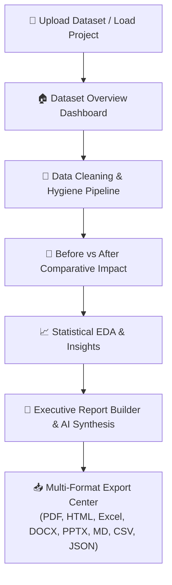
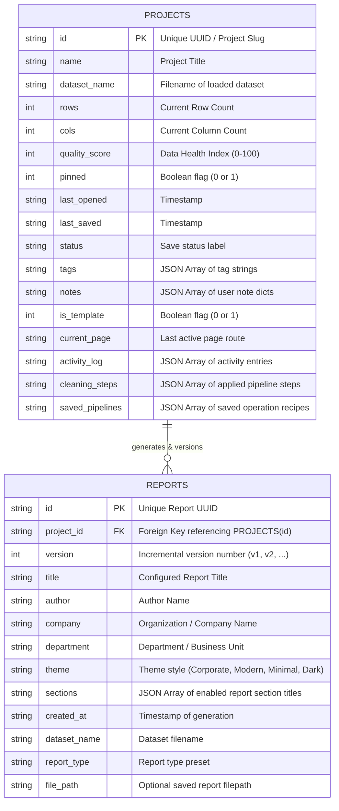
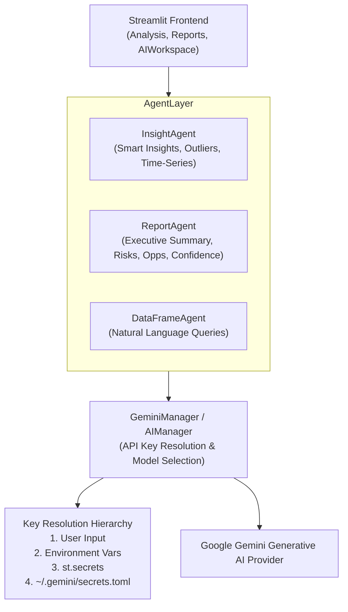

# 🚀 Data Pilot — Enterprise Data Analytics, Interactive Hygiene & AI Reporting Platform

[](https://www.python.org/)
[](https://streamlit.io/)
[](https://www.sqlite.org/)
[](https://plotly.com/)
[](LICENSE)

**Data Pilot** is an enterprise-grade, end-to-end data analytics and automated data hygiene platform. It empowers data analysts, engineers, and executives to transform raw, dirty datasets into clean, validated data pipelines and produce Power BI / Canva-style business reports in seconds.

---

## 📑 Table of Contents

- [Core Features](#-core-features)
- [End-to-End Application Workflow](#-end-to-end-application-workflow)
- [Database Schema (ER Diagram)](#-database-schema-er-diagram)
- [AI Abstraction Architecture](#-ai-abstraction-architecture)
- [Executive Report Builder & Download Center](#-executive-report-builder--download-center)
- [Repository Directory Structure](#-repository-directory-structure)
- [Tech Stack](#-tech-stack)
- [Installation & Quickstart](#-installation--quickstart)
- [Configuration & AI Secrets](#-configuration--ai-secrets)

---

## ✨ Core Features

- 📂 **Multi-Format Dataset Ingestion**: Load CSV, Excel (`.xlsx`, `.xls`), and Parquet files with automatic schema detection and quality scoring.
- 🧹 **Interactive Data Hygiene**: 11+ non-destructive cleaning operations including deduplication, missing value imputation, outlier capping (IQR/Z-Score), type casting, constant column removal, and standardization—all tracked with step-by-step undo.
- 🔄 **Before vs. After Impact Analysis**: Side-by-side comparative matrices, delta metrics (rows, missing cells, duplicates, memory footprint), and quality score gain charts.
- 📈 **Exploratory Data Analysis (EDA)**: Interactive distribution histograms, box plots, correlation heatmaps, pairwise relationship scatter plots, and time-series decomposition.
- 🤖 **Data Pilot AI Workspace**: Natural language data querying (`DataFrameAgent`), automated Smart Insights, Outlier Profiling, Time Series interpretations, and Missing Pattern diagnostics (`InsightAgent`).
- 📑 **Power BI / Canva-Style Executive Report Builder**: 3-panel report builder featuring live document preview, customizable branding, preset report templates, theme customization (`Corporate`, `Modern`, `Minimal`, `Dark`), section toggles, and real-time Report Readiness Quality scoring.
- 📥 **Multi-Format Export Engine**: One-click exports to 8 formats: **PDF**, **Interactive HTML**, **Excel (Multi-Sheet)**, **Word (.docx)**, **PowerPoint (.pptx)**, **Markdown**, **CSV**, and **JSON**.
- 💾 **SQLite Project Persistence**: Automatic background autosaving, snapshots, version timelines, crash recovery, and template dataset seeding (`Sales`, `HR`, `Customer`, `Financial`).

---

## 🔄 End-to-End Application Workflow



---

## 🗄️ Database Schema (ER Diagram)

Data Pilot uses SQLite (`projects/datapilot.db`) for lightweight, ACID-compliant persistence of project metadata, snapshots, activity logs, and report version history.



---

## 🤖 AI Abstraction Architecture

Data Pilot uses a modular AI provider abstraction layer (`ai/`). Pages and utilities interact exclusively through high-level agents, keeping LLM provider specifics completely isolated.



### Key AI Components:

1. **`ai/report_agent.py` (`ReportAgent`)**:
   - `build_report_context()`: Synthesizes aggregated dataset metrics (shape, quality gains, missing/duplicate deltas, statistical summaries, top correlations, outlier profiles) into a structured prompt context—**never sending raw dataframes**.
   - `generate_ai_report()`: Generates a complete executive JSON payload containing Executive Summary, BI Insights, Actionable Recommendations, Executive Conclusion, Risk Assessment, Opportunities, and AI Confidence Scores.
   - `generate_fallback_report()`: Provides dynamic, data-driven fallback content if AI is disconnected or rate-limited.

2. **`ai/insight_agent.py` (`InsightAgent`)**:
   - Generates dynamic observation cards across `🧠 Smart Insights`, `💼 Business Insights`, `🚨 Outliers Profile`, `📅 Time Series`, and `⚠️ Missing Patterns`.

3. **`ai/gemini_manager.py` (`GeminiManager`)**:
   - Provides multi-tier API key resolution hierarchy with automatic filesystem fallback to `secrets.toml`.

---

## 📑 Executive Report Builder & Download Center

The **Reports Page** (`pages/Reports.py`) provides an enterprise reporting experience:

### Features:
- **Preset Templates**: One-click configuration for *Executive Summary*, *Full Business Report*, *Data Quality Audit*, *Sales & Revenue*, *Technical Analytics*, and *Minimal Brief*.
- **Executive Branding & Watermarks**: Customize Title, Organization, Author, Department, and Classification Watermarks (`CONFIDENTIAL`, `INTERNAL USE ONLY`, `DRAFT`, `None`).
- **4 Theme Styles**: `Corporate`, `Modern`, `Minimal`, and `Dark`.
- **Live Preview Sheet**: Instant document preview reacting dynamically to section and styling changes.
- **Report Readiness Score Gauge**: Real-time Plotly circular gauge measuring report completeness and quality (0–100%).
- **Multi-Format Exporters (`utils/report_exporter.py`)**:
  - 📄 **PDF**: Printable document formatted via ReportLab.
  - 🌐 **HTML**: Standalone interactive web document with embedded CSS.
  - 📊 **Excel**: Multi-sheet workbook (`Executive Summary`, `Dataset Sample`, `Cleaning Log`, `Business Insights`, `Recommendations`).
  - 📝 **Word (.docx)**: Editable Word document.
  - 📽️ **PowerPoint (.pptx)**: Executive slide deck.
  - 📋 **Markdown (.md)**: GitHub-flavored markdown.
  - 💾 **CSV**: Raw metrics table.
  - ⚙️ **JSON**: Structured report spec payload.

---

## 📁 Repository Directory Structure

```text
DataPilot/
├── app.py                      # Main Streamlit application router & global navigation
├── requirements.txt            # Python dependencies (Streamlit, Pandas, Plotly, ReportLab, docx, pptx)
├── README.md                   # Project documentation & architecture overview
├── commit_changes.ps1          # PowerShell git commit helper script
├── commit_changes.sh           # Bash git commit helper script
├── ai/                         # AI Abstraction & Agent Layer
│   ├── __init__.py
│   ├── chat_manager.py         # Session chat history manager
│   ├── dataframe_agent.py      # Natural language pandas query agent
│   ├── gemini_manager.py       # API key loading & model configuration
│   ├── insight_agent.py        # Automated EDA & statistical insight agent
│   ├── intent_router.py       # Query intent router
│   ├── prompt_manager.py       # System prompts and instruction templates
│   └── report_agent.py         # Executive report synthesis & confidence scoring agent
├── pages/                      # Streamlit Page Modules
│   ├── AIWorkspace.py          # Interactive AI chat & dataset query interface
│   ├── Analysis.py             # Statistical EDA, correlations, and AI insight subtabs
│   ├── BeforeAfter.py          # Side-by-side comparative impact matrix & charts
│   ├── Cleaning.py             # Interactive hygiene operations & undo step history
│   ├── Dashboard.py            # Overview metrics, quality score, breakdown & preview
│   ├── Download.py             # Quick dataset exports & report builder navigation
│   ├── Projects.py            # SQLite project workspace catalog & template loader
│   ├── Reports.py              # 3-panel Executive Report Builder & Download Center
│   └── Settings.py             # AI API key configuration & user preferences
├── utils/                      # Core Utility Modules
│   ├── __init__.py
│   ├── analyzer.py             # Dataset shape, types, missing, correlation & profile functions
│   ├── charts.py               # Plotly chart builders & dynamic dark/light theming
│   ├── cleaner.py              # Pure data cleaning functions & quality score formulas
│   ├── helpers.py              # Session state initialization & activity log helpers
│   ├── report_builder.py       # Report data aggregation & readiness scoring
│   ├── report_exporter.py      # Multi-format report export handlers (PDF, HTML, Excel, etc.)
│   └── sync_manager.py         # SQLite DB manager, project autosaving & report history
├── assets/                     # Frontend Assets & CSS
│   └── styles.css              # Custom CSS tokens, glassmorphic headers & metric cards
└── projects/                   # SQLite Database & Local Storage Directory
    ├── datapilot.db            # SQLite database file
    ├── active_session.json     # Active session tracker
    └── [templates]/            # Pre-seeded dirty mock datasets (Sales, HR, Customer, Finance)
```

---

## 🛠️ Tech Stack

- **Frontend & App Framework**: [Streamlit](https://streamlit.io/) (Python)
- **Data Engineering**: [Pandas](https://pandas.pydata.org/), [NumPy](https://numpy.org/)
- **Visualizations**: [Plotly Py](https://plotly.com/python/) (Interactive charts with dynamic theming)
- **Database & Persistence**: SQLite 3, PyArrow (Parquet serialization)
- **AI / LLM Integration**: Google Gemini API via `ReportAgent`, `InsightAgent`, and `DataFrameAgent`
- **Document Export Engines**: [ReportLab](https://www.reportlab.com/) (PDF), [python-docx](https://python-docx.readthedocs.io/) (Word), [python-pptx](https://python-pptx.readthedocs.io/) (PowerPoint), [XlsxWriter](https://xlsxwriter.readthedocs.io/) / [OpenPyXL](https://openpyxl.readthedocs.io/) (Excel)

---

## ⚡ Installation & Quickstart

### Prerequisites
- Python 3.10 or higher
- Git

### 1. Clone the Repository
```bash
git clone https://github.com/Sarthak-1304/DataPilot.git
cd DataPilot
```

### 2. Create & Activate Virtual Environment
```bash
# Windows
python -m venv venv
venv\Scripts\activate

# macOS / Linux
python3 -m venv venv
source venv/bin/activate
```

### 3. Install Dependencies
```bash
pip install -r requirements.txt
```

### 4. Run Application Locally
```bash
streamlit run app.py
```
Open your browser at `http://localhost:8501`.

---

## 🔐 Configuration & AI Secrets

To enable full AI features (Smart Insights, Natural Language Chat, AI Report Generation):

1. **Option A (UI Settings)**: Navigate to **Settings** in the sidebar and enter your Gemini API Key.
2. **Option B (Streamlit Secrets)**: Create a `.streamlit/secrets.toml` file in the project root:
   ```toml
   GEMINI_API_KEY = "your_gemini_api_key_here"
   ```
3. **Option C (Environment Variable)**:
   ```bash
   export GEMINI_API_KEY="your_gemini_api_key_here"
   ```

*If no API key is configured, Data Pilot runs seamlessly using built-in statistical rule-based engines.*

---

## 📄 License

Distributed under the MIT License. See `LICENSE` for more information.

---

*Built with ❤️ for enterprise analytics workflows.*
